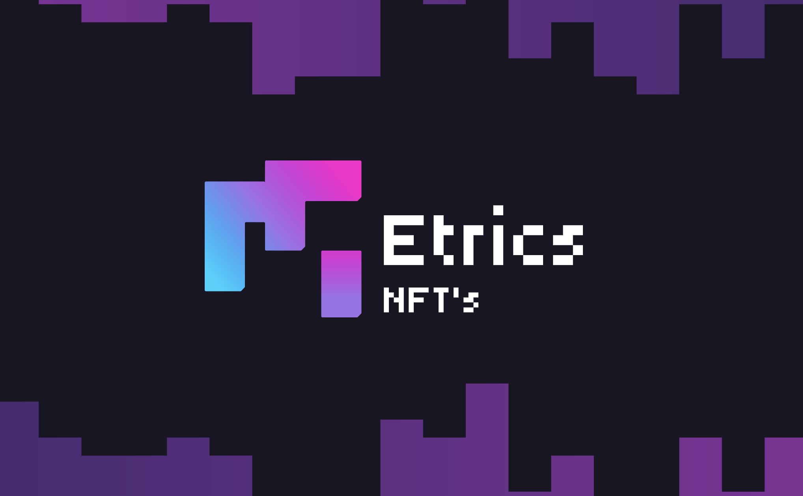
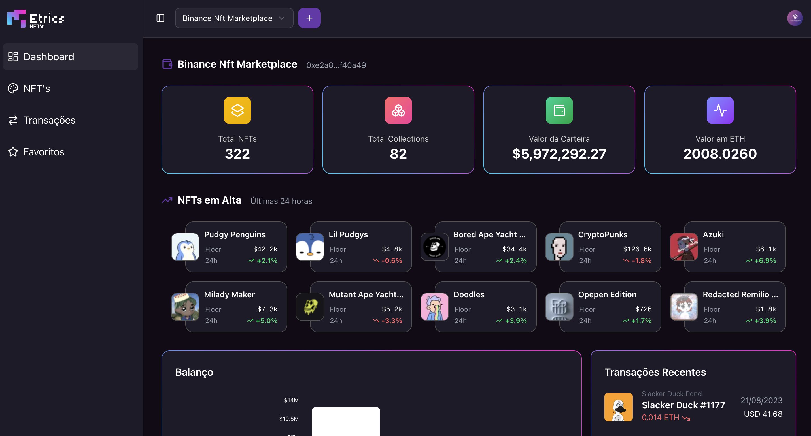
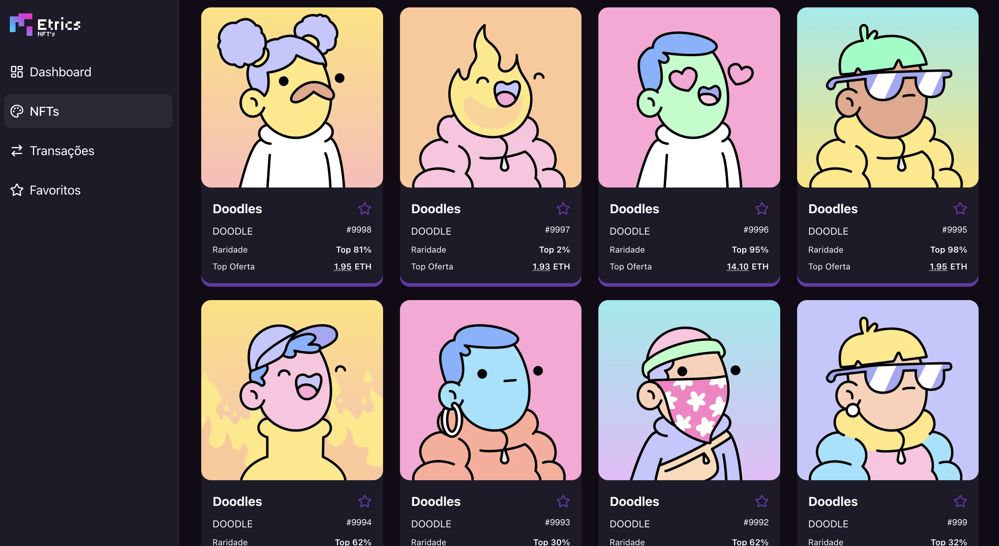
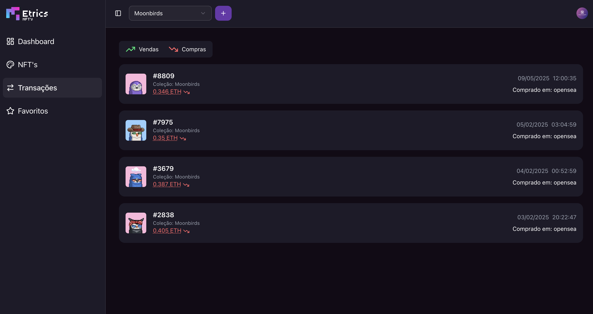
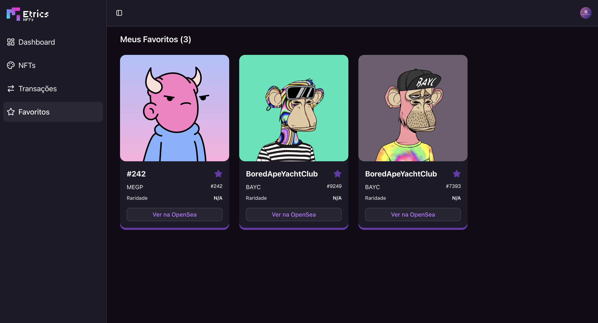

# Metrics NFT 



## ➥ Sobre o projeto

O **Metrics NFT** é uma plataforma web desenvolvida em Next.js que oferece ferramentas avançadas para monitoramento e análise de carteiras de NFTs na blockchain Ethereum. A aplicação permite aos usuários acompanhar carteiras públicas de grandes coleções como Azuki, Parallel Alpha, Bored Apes e Moonbirds, além de adicionar carteiras personalizadas para monitoramento.

O sistema oferece um dashboard completo com métricas em tempo real, incluindo valor total da carteira em USD e ETH, número de NFTs e coleções, performance de investimento com gráficos de ROI, histórico de transações recentes e análise de NFTs em alta no mercado. A plataforma implementa um sistema de autenticação via Google (Clerk), planos de assinatura (Basic e Premium) com diferentes limites de carteiras monitoradas, e integração com Stripe para pagamentos.

A interface responsiva utiliza Tailwind CSS com componentes Shadcn UI, oferecendo uma experiência moderna e intuitiva para investidores que desejam acompanhar o mercado de NFTs de forma profissional e eficiente.






## ➥ Ferramentas utilizadas

<div align="center">
  
  
  
  
</div>

<div align="center">
  
  
  
</div>

## ➥ Dependências necessárias

- next: 15.3.2

- react: ^19.0.0

- stripe: ^17.7.0

- recharts: ^3.0.2

- prettier: ^3.5.3

- sonner: ^2.0.5

- eslint: ^9

- @tanstack/react-query: ^5.83.0

## ➥ Como rodar o projeto

### 1. Clone o repositório:

```sh
git clone https://github.com/RafaelAquinodev/concurso-fsc-nft.git
```

### 2. Acesse a pasta do projeto:

```sh
cd concurso-fsc-nft
```

### 3. Instale as dependências:

```sh
npm install
```

ou, se preferir usar yarn:

```sh
yarn install
```

### 4. Inicie o servidor de desenvolvimento:

```sh
npm run dev
```

ou, se preferir usar yarn:

```sh
yarn dev
```

### 5. Acesse o projeto em [http://localhost:3000](http://localhost:3000) no seu navegador.

## ➥ APIs Consumidas

O Metrics NFT consome as seguintes APIs externas para fornecer dados e funcionalidades:

- **Moralis API**

  - Utilizada para buscar NFTs, coleções, estatísticas de carteiras, transferências e dados de mercado.
  - Endpoints principais:
    - `https://deep-index.moralis.io/api/v2.2/{address}/nft` (NFTs de uma carteira)
    - `https://deep-index.moralis.io/api/v2.2/nft/{collectionAddress}` (NFTs de uma coleção)
    - `https://deep-index.moralis.io/api/v2.2/wallets/{address}/stats` (Estatísticas da carteira)
    - `https://deep-index.moralis.io/api/v2.2/wallets/{address}/nfts/trades` (Transferências de NFTs)
    - `https://deep-index.moralis.io/api/v2.2/market-data/nfts/hottest-collections` (Coleções em alta)
    - `https://deep-index.moralis.io/api/v2.2/nft/getMultipleNFTs` (Favoritos)

- **Google Gemini API**

  - Utilizada para geração de insights automáticos sobre coleções de NFTs via IA.
  - Endpoint: `https://generativelanguage.googleapis.com/v1beta/models/gemini-2.0-flash:generateContent`

- **Stripe API**
  - Utilizada para pagamentos, assinaturas e webhooks de cobrança.

## ➥ Variáveis de Ambiente (.env)

Para o funcionamento correto do projeto, é necessário configurar as seguintes variáveis no arquivo `.env`:

- `MORALIS_API_KEY` — Chave de acesso à API Moralis.
- `GEMINI_API_KEY` — Chave de acesso à API Gemini (Google AI).
- `STRIPE_SECRET_KEY` — Chave secreta da API Stripe (backend).
- `STRIPE_WEBHOOK_SECRET` — Chave secreta para validação de webhooks Stripe.
- `STRIPE_PREMIUM_PLAN_PRICE_ID` — ID do preço do plano premium no Stripe.
- `NEXT_PUBLIC_STRIPE_PUBLISHABLE_KEY` — Chave pública Stripe para frontend.
- `NEXT_PUBLIC_APP_URL` — URL pública da aplicação (usada em callbacks do Stripe).

> **Importante:** Nunca compartilhe suas chaves secretas publicamente. Mantenha o arquivo `.env` seguro e fora do controle de versão.

## ➥ Estratégias de Performance Utilizadas

O projeto **Metrics NFT** foi desenvolvido com foco em alta performance e experiência do usuário. Abaixo estão os principais recursos, técnicas e hooks utilizados para otimizar o desempenho da aplicação:

### 1. React Query (`@tanstack/react-query`)

- **Como é usado:** O React Query é utilizado para buscar, armazenar em cache e sincronizar dados do backend (como informações de carteiras, NFTs, transações, etc).
- **Benefício:** Reduz requisições desnecessárias, melhora a experiência do usuário com dados sempre atualizados e facilita o gerenciamento de estados assíncronos, evitando recarregamentos completos da página.

### 2. Hooks customizados

- **Como são usados:** Hooks como `use-wallet-nfts`, `use-wallet-performance`, `use-infinite-scroll`, entre outros, encapsulam lógicas de busca, paginação e atualização de dados.
- **Benefício:** Promovem reuso de código, organização e facilitam a manutenção, além de garantir que componentes usem apenas os dados necessários, evitando renderizações desnecessárias.

### 3. Renderização condicional e Skeletons

- **Como é usado:** Componentes como `skeleton.tsx` e `loading-spin.tsx` exibem placeholders enquanto dados são carregados.
- **Benefício:** Melhora a percepção de velocidade, evitando telas em branco e proporcionando feedback visual imediato ao usuário.

### 4. Paginação e Infinite Scroll

- **Como é usado:** O hook `use-infinite-scroll` permite carregar grandes listas de NFTs ou transações de forma incremental, conforme o usuário navega.
- **Benefício:** Evita o carregamento de grandes volumes de dados de uma só vez, reduzindo o tempo de resposta inicial e o consumo de memória.

### 5. Otimização de imagens

- **Como é usado:** Imagens de NFTs e coleções são carregadas de forma otimizada, com tratamento de erros (`image-error-fallback.tsx`) e uso de formatos adequados.
- **Benefício:** Reduz o tempo de carregamento das páginas e evita que imagens quebradas prejudiquem a experiência do usuário.

### 6. Componentização e Lazy Loading

- **Como é usado:** Componentes são divididos em partes menores e, quando possível, carregados sob demanda.
- **Benefício:** Diminui o tamanho do bundle inicial, acelerando o carregamento da aplicação.

## ➥ Próximos passos

Nos próximos passos do Metrics NFT, está prevista a implementação de uma integração com banco de dados. Isso permitirá armazenar e gerenciar informações dos usuários, carteiras monitoradas, favoritos e métricas de forma mais eficiente, além de possibilitar novas funcionalidades e maior escalabilidade para a plataforma.

Também será adicionada uma nova sessão de NFTs por coleção, permitindo que os usuários acompanhem em tempo real a movimentação de todas as coleções de NFTs dos principais marketplaces do mercado.

Além disso, melhorias na interface do usuário (UI) serão realizadas para proporcionar uma experiência ainda mais moderna, intuitiva e agradável para todos os usuários.

## ➥ Desenvolvedores

  <ul align="center" style="display:flex; justify-content:center; align-items:center; gap: 20px">
    <li style="list-style-type:none">Erick Araújo <a href="https://github.com/araujoerick">Github</a></li>
    <li style="list-style-type:none">Houston Braga <a href="https://github.com/houstonbraga">Github</a></li>
    <li style="list-style-type:none">Rafael Aquino <a href="https://github.com/RafaelAquinodev">Github</a></li>
  </ul>
